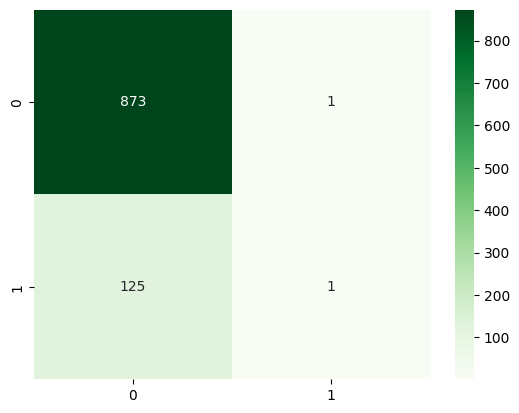
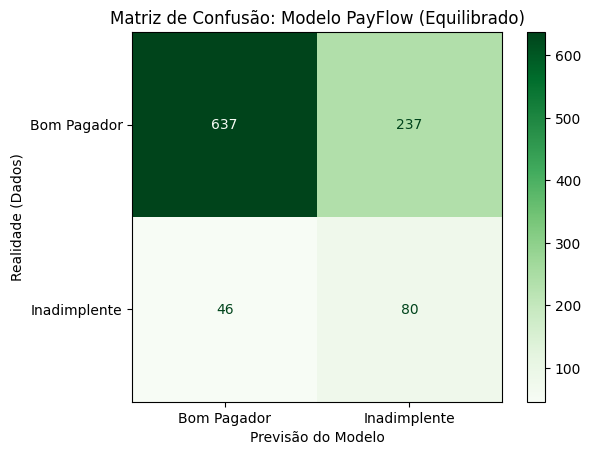
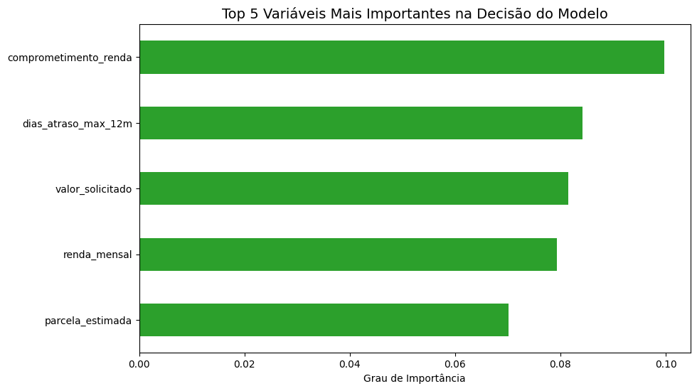

<p align="center">
  
</p>

<h1 align="center">📊 PayFlow — Previsão de Risco de Crédito</h1>

<p align="center">
  <strong>Projeto de portfólio | V2 em construção sobre dado real (Home Credit) — V1 abaixo é o registro histórico da fase com dado sintético</strong>
</p>

<p align="center">
  
  
  
  
  
  
</p>

---

## 🚧 Estado atual (2026-08-08)

A **V2** reconstrói a Camada 1 sobre dado real com outcome de default ([Home Credit Default Risk](https://www.kaggle.com/c/home-credit-default-risk)) e adiciona uma camada agêntica de underwriting (LLM) com avaliação formal — juiz calibrado, ADRs documentando cada decisão de risco (11 até aqui, [`docs/adr/`](docs/adr/)), débitos técnicos numerados e vivos ([`AGENTS.md`](AGENTS.md)).

**O que já está medido na V2:** modelo treinado sobre dado real (AUC 0,776, IC95%), zona cinzenta isolada (2.102 casos, 4,3× a taxa de default da carteira), agente com juiz LLM calibrado contra rubrica explícita ([ADR-0011](docs/adr/0011-criterio-de-task-completion.md)).

**O que ainda falta — a contribuição central do projeto:** o backtest que mede se as recomendações do agente separam risco real de fato, com `n` suficiente para significar algo (`scripts/backtest_camada2.py`, débito em aberto).

**Demo ao vivo:** despublicada (2026-08-11, débito #11). Os links do Streamlit Cloud e do Render apontavam pra **V1** — dado sintético, sem outcome real, sem backtest possível (ver limitações abaixo). Manter esse deploy no ar sob o nome do projeto atual (V2, dado real, agente com juiz) criava o risco de alguém ver o link e achar que era o estado atual. A V2 ainda não tem deploy próprio; sem demo ao vivo até lá.

## 🔎 O que este projeto assume abertamente

**Da versão 1 (no ar hoje):**

- **O dado é sintético.** Não há outcome real de inadimplência. Toda métrica mede o acerto contra o gerador do dado, não contra o mundo — não existe backtest possível.
- **Os cortes 0.40 / 0.65 nunca foram derivados.** A assimetria falso negativo × falso positivo está narrada acima corretamente, mas nunca virou cálculo. São números arbitrários, e a nota final desta página ("cada decisão de threshold foi validada") é otimista demais sobre esse ponto específico.
- **O undersampling resolveu o recall e quebrou a calibração.** Reamostrar a classe majoritária desloca a taxa base e infla sistematicamente a probabilidade prevista. Para *ranquear* clientes isso é indiferente; para *decidir* com base no valor da probabilidade, não é. A calibração nunca foi medida (nem reliability diagram, nem Brier) — o AUC não acusa esse tipo de erro.

**Da versão 2 (em construção):**

- **O dataset é de mercados emergentes, não do Brasil.** A transferência é de **método**, declarada. O contexto macro brasileiro (BCB/IBGE) entra apenas como cenário de stress rotulado, deslocando a premissa de perda dada a inadimplência — nunca como atributo do cliente ([ADR-0008](docs/adr/0008-cenario-macro-brasileiro-pela-lgd.md)).
- **A LGD (70–85%) é premissa, não medição.** Ancorada em literatura internacional; não existe número público do Banco Central para crédito pessoal brasileiro.
- **Não há decisão de crédito autônoma.** O agente propõe e um humano decide. "Deferir" é ação de primeira classe.
- **Sem consulta a bureau individual** — não existe API pública no Brasil, e o projeto não finge consultar o que não pode.

Os débitos técnicos completos, numerados e vivos, estão em [`AGENTS.md`](AGENTS.md#débitos-técnicos-conhecidos).

---

## 📋 Metodologia — CRISP-DM

O projeto segue o ciclo **CRISP-DM** (Cross Industry Standard Process for Data Mining):

| Fase | Descrição |
|------|-----------|
| 1. Entendimento do Negócio | Definição do problema e métricas-chave |
| 2. Entendimento dos Dados | EDA, análise de nulos e distribuições |
| 3. Preparação dos Dados | Imputação, remoção de data leakage, encoding |
| 4. Modelagem | Random Forest com e sem balanceamento |
| 5. Avaliação | Classification Report + Matriz de Confusão |
| 6. Deploy | App interativo via Streamlit em `app/main.py` |

---

## 🎯 Problema de Negócio

A empresa **PayFlow** precisa reduzir a inadimplência de sua carteira de crédito. O objetivo é criar um modelo preditivo capaz de identificar, com até **90 dias de antecedência**, quais clientes têm alto risco de não honrar seus compromissos financeiros.

### Por que isso importa?

- Um **Falso Negativo** (não detectar um inadimplente) = **prejuízo total**: o crédito foi concedido e não será recuperado.
- Um **Falso Positivo** (barrar um bom pagador) = **custo de oportunidade**: perda de margem, mas sem perda de capital.

> Essa **assimetria de custos** guiou todas as decisões técnicas do projeto, especialmente a escolha das métricas de avaliação.

---

## 🔍 EDA e Preparação dos Dados

Antes da modelagem, realizei uma **Análise Exploratória de Dados (EDA)** para garantir a qualidade dos inputs:

- **Tratamento de Dados:** Identificação de valores nulos, tratamento de **data leakage** e tratamento de dados categóricos.
- **Imputação:** Mediana para renda (resistente a outliers), regra de negócio para tempo de emprego (0 para autônomos).
- **Remoção de Leakage:** Colunas com informações do futuro (`parcelas_pagas_ate_3m`, `atraso_primeira_parcela_dias`, `status_apos_90d`) foram removidas.

---

## 📉 A Jornada de Modelagem: Falhas e Insights

### Tentativa 1: A Armadilha da Acurácia Alta

Inicialmente, treinei o modelo com a base bruta (desbalanceada).

- **Resultado:** 90% de Acurácia, porém **recall de apenas 1%**.
- **O "Porquê" deu errado:** O modelo sofreu um **"vício da maioria"**. Como havia poucos inadimplentes, ele aprendeu a dizer que todos pagariam, errando 99% dos calotes, mas mantendo uma nota alta. Para o negócio, **este modelo era inútil**.

<p align="center">
  
  <br>
  <em>Matriz de Confusão — Modelo Inicial (desbalanceado)</em>
</p>

### Tentativa 2: Correção Proativa (Foco no Risco)

Entendendo o "porque" do resultado anterior (viés), apliquei o **UnderSampling**.

O modelo passou a identificar **63% dos inadimplentes**, aceitando como trade-off uma taxa maior de falsos positivos — decisão justificada pela assimetria de custos do negócio.


<p align="center">
  
  <br>
  <em>Comparativo: Modelo Corrigido com Undersampling</em>
</p>

### Comparativo: Modelo Inicial vs. Modelo Corrigido

> O modelo inicial tinha acurácia alta, mas era **inútil para o negócio**: identificava apenas 1 inadimplente real em 126.
> Esse foi o **principal aprendizado do projeto** — acurácia alta ≠ modelo bom.

---

## 💎 Ciclo de Lapidação: Evolução Pós-Feedback

A partir da Fase 8, o projeto passou por rodadas de **refinamento técnico e estratégico**, focadas em transformar um modelo de aprendizado de máquina em uma **solução real de prateleira** para o mercado de crédito.

### Fase 8: Testes de Alternativas ao Undersampling

- **O quê:** Teste comparativo entre **SMOTE** (geração de dados sintéticos) e **`class_weight='balanced'`**.
- **O porquê:** Avaliar se conseguiríamos manter o volume total de dados de bons pagadores sem perder a sensibilidade para os inadimplentes.
- **Resultado:** O Undersampling continuou sendo a abordagem superior para este cenário. O SMOTE e o Class Weight entregaram um Recall extremamente baixo (<10%).

### Fase 9: Engenharia de Variáveis (A Intuição Econômica)

- **O quê:** Criação de novos indicadores financeiros derivados dos dados brutos.
  - `comprometimento_renda`: (Parcela Estimada / Renda Mensal)
  - `intensidade_credito`: Cruzamento de uso de limite e quantidade de cartões
- **O porquê:** Um modelo de crédito é mais eficaz quando entende a **"capacidade de pagamento"** e não apenas o histórico.


<p align="center">
  
  <br>
  <em>Feature Importance: As variáveis econômicas criadas dominam a decisão do modelo</em>
</p>

### Fase 10: Quantificação Financeira (Perda Evitada)

- **O quê:** Tradução da Matriz de Confusão em **valores monetários (R$)**.
- **O porquê:** Métrica de "Acurácia" não paga as contas da empresa. Criamos um relatório de impacto que demonstra:
  - **Perda Evitada:** O montante financeiro que deixou de sair do caixa.
  - **Custo de Oportunidade:** O valor que deixamos de ganhar ao ser excessivamente conservadores.
- **Resultado:** Impacto líquido positivo estimado em **R$ 186.000,00** na base de testes.

### Fase 11: Arquitetura de Produção e Deploy

- **Serialização:** Exportação do modelo via `joblib` (`.pkl`).
- **Pipeline de Entrada:** Estrutura para receber dados via JSON.
- **Saída Estruturada:** A API não responde apenas 0 ou 1, mas sim uma recomendação de ação:

| Probabilidade de Risco | Decisão |
|------------------------|---------|
| < 40% | ✅ **Aprovar** |
| 40% - 65% | ⚠️ **Revisar** |
| > 65% | ❌ **Negar** |

**Exemplo de Output JSON:**
```json
{
  "id_cliente": 12345,
  "probabilidade_risco": 0.72,
  "decisao": "Negar",
  "motivo": "Risco acima do limite auto-aprovado (65%)"
}
```

---

## 🧠 Modelo Serializado (.pkl)

O modelo final foi exportado via `joblib` e está disponível na pasta `models/` para uso direto sem necessidade de retreinar.

| Arquivo | Tamanho | Conteúdo |
|---------|---------|----------|
| `models/modelo_payflow_v1.pkl` | ~3 MB | RandomForestClassifier treinado (100 estimators) |
| `models/colunas_modelo.pkl` | ~600 bytes | Lista ordenada das 30 features esperadas pelo modelo |

### Métricas do Modelo Final

| Métrica | Valor |
|---------|-------|
| **Recall (inadimplentes)** | 60% |
| **Perda Evitada** | R$ 380.000,00 |
| **Custo de Oportunidade** | R$ 179.200,00 |
| **Impacto Líquido** | R$ 200.800,00 |

### Como Rodar o Dashboard Streamlit (Nível 3 CRISP-DM)

O projeto conta com um deploy funcional em Streamlit, tornando o modelo amigável e acessível.

```bash
# Navegue até a pasta raiz
cd Payflow-inadimplencia

# Rode o Streamlit
streamlit run app/main.py
```

O simulador abrirá em seu navegador, permitindo a entrada interativa de dados de clientes e retornando a **probabilidade de inadimplência** com a respectiva recomendação calculada na nuvem.

---

## 📂 Estrutura do Projeto

```
Payflow-inadimplencia/
├── app/
│   ├── api.py          # Rotas FastAPI (Backend REST)
│   ├── schemas.py      # Contratos de entrada/saída (Pydantic)
│   ├── service.py      # CreditScoringService (Deep Module)
│   ├── utils.py        # ⭐ Feature Engineering centralizado (Anti Training-Serving Skew)
│   └── main.py         # Streamlit App (Frontend)
├── tests/
│   └── test_paridade.py  # Testes de paridade treino-serventia (pytest)
├── data/raw/
│   └── payflow_credit_risk.csv
├── notebooks/
│   └── 01_credit_risk_modeling_payflow.ipynb
├── models/
│   ├── modelo_payflow_v1.pkl
│   └── colunas_modelo.pkl
├── reports/figures/
├── Dockerfile.api        # Container da API (Render)
├── Dockerfile.front      # Container do Frontend (Streamlit)
├── docker-compose.yml    # Orquestração local
├── render.yaml           # IaC: Deploy declarativo no Render
├── Makefile              # Atalhos de execução
├── requirements.txt
└── README.md
```

---

## 🚀 Como Rodar o Notebook (Análise)

### Pré-requisitos
- Python 3.10 ou superior
- pip (gerenciador de pacotes)

### Passo a passo

```bash
# 1. Clone o repositório
git clone https://github.com/luizmaibashi/Payflow-inadimplencia.git
cd Payflow-inadimplencia

# 2. Crie um ambiente virtual (recomendado)
python -m venv .venv

# 3. Ative o ambiente virtual
# Windows:
.venv\Scripts\activate
# Linux/Mac:
source .venv/bin/activate

# 4. Instale as dependências
pip install -r requirements.txt

# 5. Abra o notebook
jupyter notebook notebooks/01_credit_risk_modeling_payflow.ipynb
```

---

## 📝 Conclusão e Reflexões

**Modelo como Estratégia de Negócio:** A conclusão deste projeto marca a minha transição de um "estudante de código" para um **"analista de soluções"**. O maior aprendizado não foi o uso da biblioteca Scikit-Learn, mas sim o entendimento de que **um modelo com 90% de acurácia pode ser inútil** se ele não resolver a dor do caixa.

### Lições Principais

- **Decisão Baseada em Dados:** Saímos do "acho" para faixas de probabilidade reais.
- **Visão Financeira:** Traduzimos o erro do modelo em **Perda Evitada (R$)**, permitindo que a diretoria visualize o ROI da área de dados.
- **Engenharia de Valor:** A criação de variáveis como `comprometimento_renda` provou que a **inteligência humana e o conhecimento econômico** são o que realmente "ensinam" a máquina a ser precisa.
- **Humildade Técnica:** Testar o SMOTE e o Class Weight e aceitar que o Undersampling era a melhor saída — mesmo sendo uma técnica mais simples — mostra que no mercado real, o que importa é a **eficácia e a segurança do capital**.

---

### 📌 Nota sobre o uso de Inteligência Artificial

Utilizei a IA como um **co-piloto de aprendizado**. Para cada conceito complexo, fiz o exercício reverso: *"Por que isso funciona assim?"*. Nesta documentação, não há "caixas pretas". Cada decisão de threshold, cada escolha de hiperparâmetro e cada cálculo financeiro foi validado e compreendido.

---

## 👤 Autor

**Luiz Fernando Saguma Maibashi**
- Economista | Pós-Tech AI Scientist FIAP
- 📍 São Paulo - SP
- [](https://www.linkedin.com/in/luiz-fernando-maibashi-515073212/)
- [](https://github.com/luizmaibashi)
